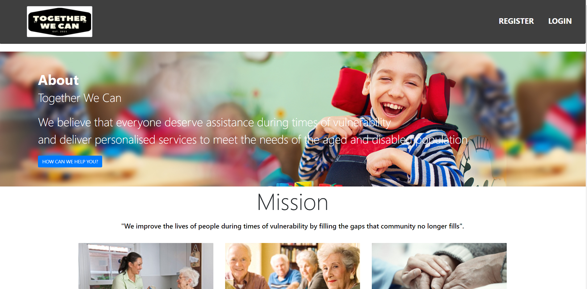
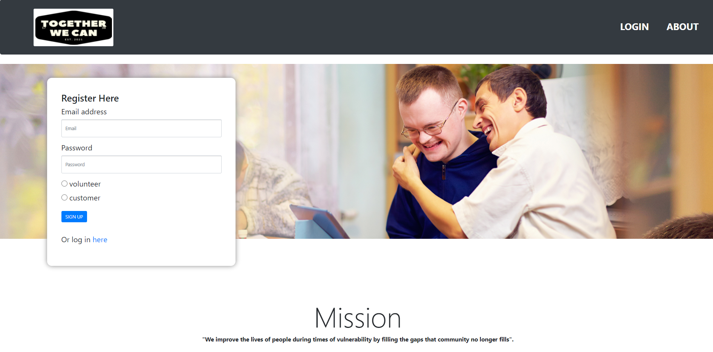
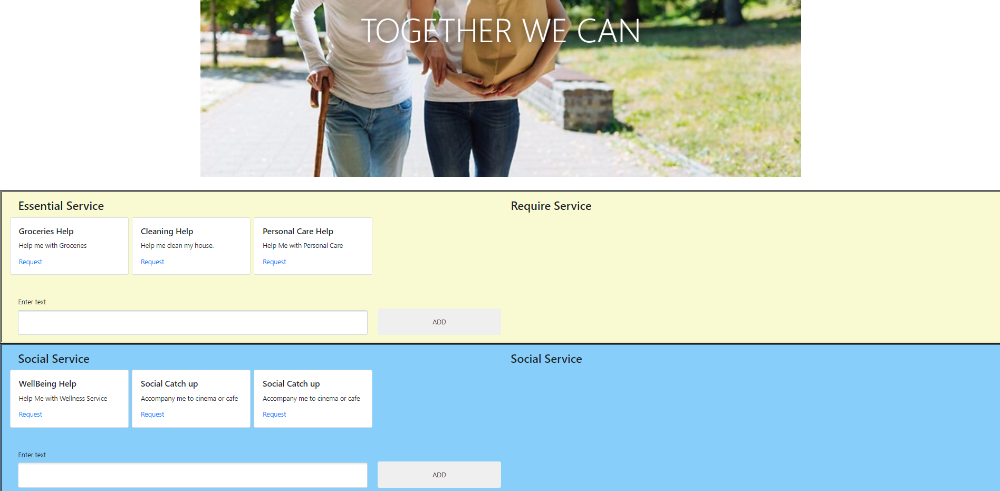
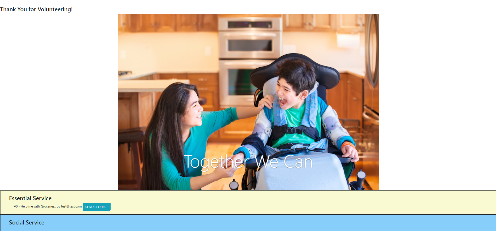

# Project-2 - Together We Can 

###### Together We Can About Page
### Description
Together We Can is a web application built to meet the challenges elderly & disabled people face, especially during the COVID-19 pandemic. Using this application, these individuals can post requests for volunteers to assist them with essential & social services. 

### Installation
Installation is not necessary to view the application as it is hosted on Heroku, with the link provided below.

### Usage
When a user accesses the application they are sent to the login page, which is the application's landing page. The user can then either login on an already existing account or register a new account. During registration, the user can select to register as either a customer or a volunteer. Once registration is complete the user is sent back to the login page, where they can then log into their new account.

###### Registration Page

Depending on which role the user registered as, they will be sent to a specific page. Customers are sent to the customer page and the volunteers are sent to the volunteer page. On the customer page, the user can make service requests, either from the pre-determined options provided or custom services the user can create. 

###### Customer Page

The requests are then sent to the request pool, which can be accessed by the volunteers on the volunteers page. A volunteer can then select which service they wish to fulfill from the pool. A request is sent back to the customer who made the request so they can either approve or deny the specific volunteer volunteering to do their request.

###### Volunteer Page

### Future Development
* Administor role, which will have a dashboard screen attached to it to view statistics about the site - such as which locations are requesting the most services, which volunteers are fulfilling most requests, etc.
* Adding location (Postcode) to service requests and volunteers, allowing both to make decisions about which requests to accept and which volunteers to approve based off of their location.
* Uploading Police Clearance, COVID-19 vaccine proof, recent travel history, cert III or cert IV in disability or agedcare sector. This will help vet potentially unsavoury individuals who wish to volunteer.
* Configure the eMail functionality to inform both the volunteer and the customer regarding the status of their requests instead of just the volunteer.
* Contact page for users to make suggestions and complaints to the developers. 

### Contributing
We are currently not accepting any contributions to this project, but this may change in the future.
### Links
GitHub Repostiroy: https://github.com/Foggles/Project-2

Heroku Deployment: https://backend-warriors-project-2.herokuapp.com/login

### Authors
Jack: https://github.com/Foggles

Hamish: https://github.com/Hisaacs

Alisha: https://github.com/AlishaPanday

Herve: https://github.com/Herve8

### License
Copyright 2021 Backend-Warriors

Permission is hereby granted, free of charge, to any person obtaining a copy of this software and associated documentation files (the "Software"), to deal in the Software without restriction, including without limitation the rights to use, copy, modify, merge, publish, distribute, sublicense, and/or sell copies of the Software, and to permit persons to whom the Software is furnished to do so, subject to the following conditions:

The above copyright notice and this permission notice shall be included in all copies or substantial portions of the Software.

THE SOFTWARE IS PROVIDED "AS IS", WITHOUT WARRANTY OF ANY KIND, EXPRESS OR IMPLIED, INCLUDING BUT NOT LIMITED TO THE WARRANTIES OF MERCHANTABILITY, FITNESS FOR A PARTICULAR PURPOSE AND NONINFRINGEMENT. IN NO EVENT SHALL THE AUTHORS OR COPYRIGHT HOLDERS BE LIABLE FOR ANY CLAIM, DAMAGES OR OTHER LIABILITY, WHETHER IN AN ACTION OF CONTRACT, TORT OR OTHERWISE, ARISING FROM, OUT OF OR IN CONNECTION WITH THE SOFTWARE OR THE USE OR OTHER DEALINGS IN THE SOFTWARE.

